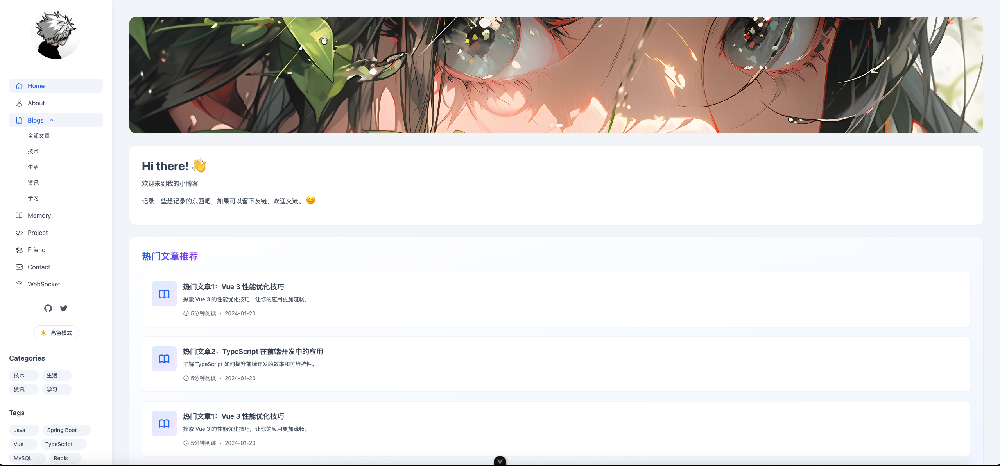
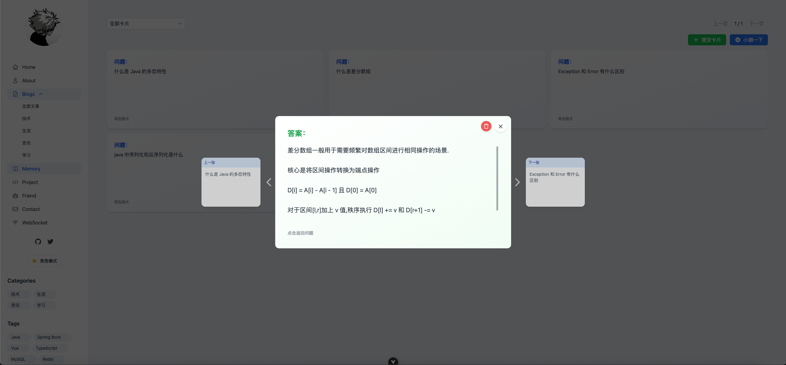
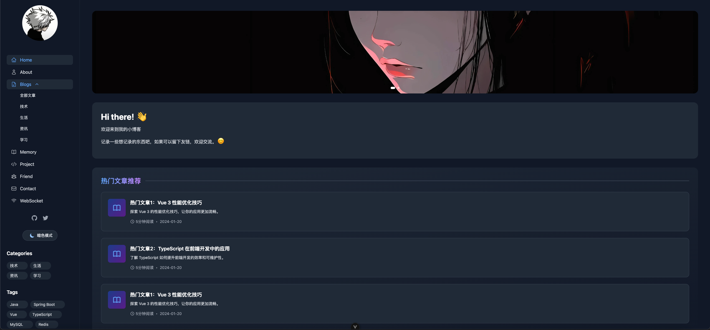
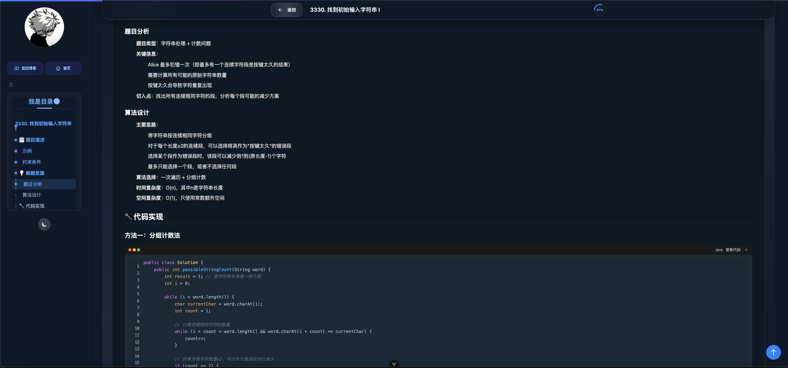

a# XuanBlog Backend

<div align="center">
  
  [简体中文](./README.zh-CN.md) | English
  
  [](https://www.oracle.com/java/)
  [](https://spring.io/projects/spring-boot)
  [](https://www.mysql.com/)
  [](https://redis.io/)
  [](LICENSE)
  
</div>

## 📖 Project Introduction






XuanBlog Backend is a modern blog system backend service built based on Spring Boot 3.5. The project adopts a microservice architecture design, integrating functions such as blog management, user authentication, image upload, real-time communication, and intelligent memory cards, aiming to provide a fully functional and high-performance personal blog solution.

### ✨ Core Features

- **📝 Complete Blog Management**: Supports CRUD operations for articles, category management, tag systems, and comment interactions
- **🔐 Secure Authentication & Authorization**: Flexible permission control system implemented based on Sa-Token
- **🖼️ Diverse Image Storage**: Supports GitHub CDN and MinIO object storage
- **💬 Real-time Message Notification**: Real-time communication function based on WebSocket
- **🧠 Intelligent Memory System**: Implements a memory card system with the SM-17 algorithm, supporting scientific review
- **⚡ High-performance Caching**: Redis + Caffeine dual-layer caching architecture
- **📊 Comprehensive Monitoring**: Interface log recording, performance analysis, and exception tracking
- **🐳 Containerized Deployment**: Complete Docker Compose deployment solution

## 🛠️ Technology Stack

### Backend Framework
- **Spring Boot 3.5.0** - Main framework
- **Spring Web** - RESTful API
- **Spring WebSocket** - Real-time communication
- **Spring AOP** - Aspect-oriented programming

### Data Storage
- **MySQL 8.0** - Primary database
- **Redis 7.0** - Caching & session storage
- **MyBatis-Plus 3.5.11** - ORM framework

### Security & Authentication
- **Sa-Token 1.41.0** - Permission authentication framework
- **JWT** - Token management

### Tool Libraries
- **Knife4j 4.4.0** - API documentation
- **Hutool 5.8.26** - Toolkit
- **Fastjson2** - JSON processing
- **Caffeine** - Local caching
- **Redisson 3.45.1** - Distributed locks

### Storage Services
- **MinIO** - Object storage
- **GitHub** - Image CDN

### Deployment-related
- **Docker** - Containerization
- **Docker Compose** - Orchestration tool
- **Maven** - Build tool

## 📁 Project Structure

```
XuanBlog_Backend/
├── blog_admin/              # Management entry module
│   └── src/
│       └── main/
│           ├── java/        # Main application
│           └── resources/   # Configuration files
├── blog_common/             # Common module
│   └── src/
│       └── main/
│           └── java/
│               ├── config/  # Global configuration
│               ├── entity/  # Common entities
│               ├── exception/ # Exception handling
│               └── handler/ # Processors
├── blog_system/             # System core module
│   └── src/
│       └── main/
│           └── java/
│               ├── annotation/ # Custom annotations
│               ├── aop/      # Aspect-oriented programming
│               ├── controller/ # Controllers
│               ├── domain/   # Domain models
│               ├── mapper/   # Data access
│               └── service/  # Business logic
├── blog_modules/            # Functional modules
│   ├── blog_card/          # Memory card module
│   ├── blog_message/       # Message module
│   └── blog_upload/        # Upload module
├── sql/                     # Database scripts
├── docker-compose.yml       # Docker orchestration file
└── Dockerfile              # Docker image definition
```

## 🚀 Quick Start

### Environment Requirements

- JDK 21+
- Maven 3.8+
- Docker & Docker Compose (optional)

### Local Development

1. **Clone the project**
```bash
git clone https://github.com/yourusername/XuanBlog_Backend.git
cd XuanBlog_Backend
```

2. **Configure the database**
```bash
# Create database
mysql -u root -p
CREATE DATABASE blog CHARACTER SET utf8mb4 COLLATE utf8mb4_unicode_ci;

# Import data
mysql -u root -p blog < sql/blog.sql
```

3. **Modify configuration**
```yaml
# Edit blog_admin/src/main/resources/application.yml
spring:
  datasource:
    url: jdbc:mysql://localhost:3306/blog
    username: your_username
    password: your_password
  redis:
    host: localhost
    port: 6379
```

4. **Start the project**
```bash
mvn clean install
mvn spring-boot:run -pl blog_admin
```

### Docker Deployment

1. **Use Docker Compose for one-click deployment**
```bash
# Build and start all services
docker-compose up -d

# View service status
docker-compose ps

# View logs
docker-compose logs -f xuanblog-app
```

2. **Access services**
- Application service: http://localhost:8901/api
- API documentation: http://localhost:8901/api/doc.html
- MinIO console: http://localhost:9001
- MySQL: localhost:3307
- Redis: localhost:6379

## 📡 API Documentation

The project integrates Knife4j. After starting, visit http://localhost:8901/api/doc.html to view the complete API documentation.

## 🏗️ Architecture Design

### System Architecture

```
┌─────────────┐     ┌─────────────┐     ┌─────────────┐
│   Frontend  │────▶│   Nginx    │────▶│ Spring Boot │
└─────────────┘     └─────────────┘     └─────────────┘
                                               │
                    ┌──────────────────────────┼──────────────────────────┐
                    │                          │                          │
                    ▼                          ▼                          ▼
            ┌─────────────┐           ┌─────────────┐           ┌─────────────┐
            │    MySQL    │           │    Redis    │           │   MinIO     │
            └─────────────┘           └─────────────┘           └─────────────┘
```

### Core Functional Modules

#### 1. Blog Management Module
- CRUD operations for articles
- Rich text editor support
- Markdown rendering
- Category and tag management
- Article statistical analysis

#### 2. User Authentication Module
- Authentication based on Sa-Token
- Role and permission management
- Session management
- Login status maintenance

#### 3. Cache System
- Redis distributed caching
- Caffeine local caching
- Cache annotation support
- Cache preheating and update strategies

#### 4. Memory Card System
- **SM-17 Algorithm Implementation**: Based on a three-component memory model (difficulty, stability, retrieval ability)
- **Intelligent Review Scheduling**: Automatically calculates the optimal review time based on the forgetting curve
- **Learning Data Analysis**: Provides detailed learning progress and effectiveness analysis
- **Algorithm Comparison**: Supports switching between SM-2 and SM-17 algorithms and comparing their effects

#### 5. Message Notification System
- WebSocket real-time communication
- Message push mechanism
- Online user management
- Message persistence

## 🔧 Configuration Instructions

### Application Configuration

```yaml
# Main configuration items in application.yml
server:
  port: 8901
  servlet:
    context-path: /api

spring:
  datasource:
    url: jdbc:mysql://localhost:3306/blog
    username: root
    password: password
    
  redis:
    database: 0
    host: localhost
    port: 6379
    
sa-token:
  token-name: xuanBlog
  timeout: 2592000
  token-style: uuid
  
# File upload configuration
blog:
  upload:
    type: github  # Options: github or minio
    github:
      token: your_github_token
      owner: your_github_username
      repo: your_repo_name
    minio:
      endpoint: http://localhost:9000
      accessKey: minioadmin
      secretKey: minioadmin123
```

### Environment Configuration

The project supports multi-environment configuration:
- `dev` - Development environment (default)
- `test` - Testing environment
- `prod` - Production environment
- `docker` - Docker environment

## 📈 Performance Optimization

1. **Database Optimization**
   - Reasonable index design
   - Pagination query optimization
   - Slow query log monitoring

2. **Caching Strategies**
   - Hot data caching
   - Cache penetration protection
   - Cache avalanche handling

3. **Interface Optimization**
   - Interface rate limiting
   - Request merging
   - Asynchronous processing

## 🔐 Security Measures

- XSS protection
- SQL injection protection
- CSRF protection
- Sensitive data encryption
- Interface permission control
- Request frequency limitation

## 📝 Development Specifications

1. **Code Specifications**
   - Follow Alibaba Java Development Manual
   - Unified code formatting
   - Complete documentation comments

2. **Git Specifications**
   - feat: New features
   - fix: Bug fixes
   - docs: Documentation updates
   - style: Code formatting adjustments
   - refactor: Code refactoring
   - test: Testing-related changes
   - chore: Changes to the build process or auxiliary tools

## 🤝 Contribution Guidelines

Welcome to submit Issues and Pull Requests!

1. Fork this repository
2. Create your feature branch (`git checkout -b feature/AmazingFeature`)
3. Commit your changes (`git commit -m 'Add some AmazingFeature'`)
4. Push to the branch (`git push origin feature/AmazingFeature`)
5. Open a Pull Request

## 📄 License

This project is licensed under the MIT License - see the [LICENSE](LICENSE) file for details

## 👨‍💻 Author

- **Ezhixuan** - *Initial work* - [GitHub](https://github.com/ezhixuan)

---

<div align="center">
  <p>If this project helps you, please give it a ⭐️ Star!</p>
</div>
